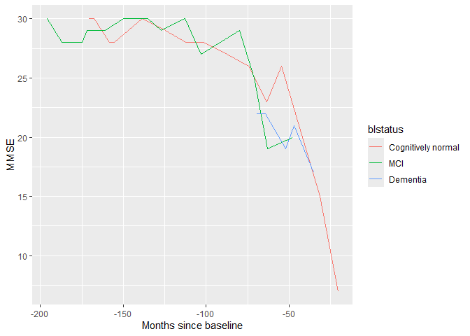

Alzheimer’s disease
================
Ruben Cabrera
2024-07-19

## Introduction to Nonlinear Mixed Effects Modeling

Based in <https://github.com/larslau/progmod?tab=readme-ov-file>

``` r
# install.packages('devtools')
# devtools::install_github('larslau/progmod')

library(progmod)
```

    ## Loading required package: covBM

    ## Loading required package: nlme

``` r
library(ggplot2)
```

## Data

``` r
summary(adas_mmse_data)
```

    ##    subject_id      Month_bl          ADAS13           MMSE      
    ##  358    :  15   Min.   :  0.00   Min.   : 0.00   Min.   : 0.00  
    ##  15     :  14   1st Qu.:  3.00   1st Qu.:12.33   1st Qu.:24.00  
    ##  110    :  14   Median : 13.00   Median :20.00   Median :26.00  
    ##  168    :  14   Mean   : 22.11   Mean   :21.49   Mean   :25.49  
    ##  215    :  13   3rd Qu.: 33.00   3rd Qu.:28.67   3rd Qu.:29.00  
    ##  242    :  13   Max.   :150.00   Max.   :85.00   Max.   :30.00  
    ##  (Other):3459                    NA's   :56      NA's   :6      
    ##        CN              MCI              DEM           blstatus        
    ##  Min.   :0.0000   Min.   :0.0000   Min.   :0.0000   Length:3542       
    ##  1st Qu.:0.0000   1st Qu.:0.0000   1st Qu.:0.0000   Class :character  
    ##  Median :0.0000   Median :1.0000   Median :0.0000   Mode  :character  
    ##  Mean   :0.1993   Mean   :0.6172   Mean   :0.1835                     
    ##  3rd Qu.:0.0000   3rd Qu.:1.0000   3rd Qu.:0.0000                     
    ##  Max.   :1.0000   Max.   :1.0000   Max.   :1.0000                     
    ## 

``` r
str(adas_mmse_data)
```

    ## 'data.frame':    3542 obs. of  8 variables:
    ##  $ subject_id: Factor w/ 756 levels "1","2","3","4",..: 1 1 1 1 2 2 2 2 2 3 ...
    ##  $ Month_bl  : num  0 4 17 24 0 11 14 30 33 0 ...
    ##  $ ADAS13    : num  21.3 22.3 26.7 36.3 23.7 ...
    ##  $ MMSE      : num  25 23 23 21 26 23 25 26 23 29 ...
    ##  $ CN        : num  0 0 0 0 0 0 0 0 0 1 ...
    ##  $ MCI       : num  0 0 0 0 1 1 1 1 1 0 ...
    ##  $ DEM       : num  1 1 1 1 0 0 0 0 0 0 ...
    ##  $ blstatus  : chr  "Dementia" "Dementia" "Dementia" "Dementia" ...

``` r
head(adas_mmse_data)
```

    ##       subject_id Month_bl ADAS13 MMSE CN MCI DEM blstatus
    ## 5986           1        0  21.33   25  0   0   1 Dementia
    ## 5987           1        4  22.33   23  0   0   1 Dementia
    ## 5988           1       17  26.67   23  0   0   1 Dementia
    ## 5990           1       24  36.33   21  0   0   1 Dementia
    ## 12727          2        0  23.67   26  0   1   0      MCI
    ## 12729          2       11  21.33   23  0   1   0      MCI

``` r
# Expressing blstatus as factor (ordered):

adas_mmse_data$blstatus <- factor(adas_mmse_data$blstatus, levels = c("Cognitively normal", "MCI", "Dementia")) 
```

As you can see, we have the variables ADAS13 and MMSE, indicators of
mental capacity. The bigger ADAS13 number, the lower mental capacity The
lower MMSE scores, the lower mental capacity.

We have also predefined blstatus as:

- Cognitively normal
- MCI
- Dementia

Let’s explore the data with some plots

``` r
plot(adas_mmse_data$ADAS13,adas_mmse_data$MMSE)
```

<!-- -->

``` r
plot(adas_mmse_data$Month_bl,adas_mmse_data$MMSE)
```

<!-- -->

``` r
boxplot(adas_mmse_data$ADAS13 ~ adas_mmse_data$blstatus)
```

<!-- -->

``` r
boxplot(adas_mmse_data$MMSE ~ adas_mmse_data$blstatus)
```

<!-- -->

``` r
sampledata <- adas_mmse_data[adas_mmse_data$subject_id == 627 | adas_mmse_data$subject_id == 358 | adas_mmse_data$subject_id == 168,]

sampledata
```

    ##      subject_id Month_bl ADAS13 MMSE CN MCI DEM           blstatus
    ## 1495        168        0  10.00   30  1   0   0 Cognitively normal
    ## 1496        168        3   7.33   30  1   0   0 Cognitively normal
    ## 1498        168       12   6.67   28  1   0   0 Cognitively normal
    ## 1503        168       15   6.67   28  1   0   0 Cognitively normal
    ## 1505        168       32  12.33   30  1   0   0 Cognitively normal
    ## 1507        168       46  12.33   29  1   0   0 Cognitively normal
    ## 1509        168       58  12.67   28  1   0   0 Cognitively normal
    ## 1511        168       69  16.00   28  1   0   0 Cognitively normal
    ## 1513        168       83  15.00   27  1   0   0 Cognitively normal
    ## 1515        168       96  12.33   26  1   0   0 Cognitively normal
    ## 1497        168      107  24.33   23  1   0   0 Cognitively normal
    ## 1499        168      116  31.67   26  1   0   0 Cognitively normal
    ## 1500        168      139  60.00   15  1   0   0 Cognitively normal
    ## 1501        168      150  71.33    7  1   0   0 Cognitively normal
    ## 689         358        0   9.67   30  0   1   0                MCI
    ## 692         358        9  13.33   28  0   1   0                MCI
    ## 690         358       10   9.67   28  0   1   0                MCI
    ## 696         358       21  13.33   28  0   1   0                MCI
    ## 697         358       24   9.33   29  0   1   0                MCI
    ## 699         358       35  11.00   29  0   1   0                MCI
    ## 701         358       46   9.67   30  0   1   0                MCI
    ## 703         358       61  12.67   30  0   1   0                MCI
    ## 705         358       69  15.33   29  0   1   0                MCI
    ## 707         358       83     NA   30  0   1   0                MCI
    ## 709         358       93  18.67   27  0   1   0                MCI
    ## 691         358      116  25.67   29  0   1   0                MCI
    ## 693         358      125  25.67   25  0   1   0                MCI
    ## 694         358      133  38.00   19  0   1   0                MCI
    ## 695         358      148  41.00   20  0   1   0                MCI
    ## 4388        627        0  28.67   22  0   0   1           Dementia
    ## 4389        627        5  31.67   22  0   0   1           Dementia
    ## 4390        627       17  33.00   19  0   0   1           Dementia
    ## 4392        627       22  37.67   21  0   0   1           Dementia
    ## 4394        627       34  44.33   17  0   0   1           Dementia

``` r
## ADAS13 for sampledata

ggplot(sampledata, aes(x = Month_bl, y = ADAS13)) +
geom_line(aes(group = subject_id, color = blstatus)) +
ylim(c(85, 0)) + xlab('Months since baseline')
```

<!-- -->

``` r
## MMSE for sampledata

ggplot(sampledata, aes(x = Month_bl, y = MMSE)) +
geom_line(aes(group = subject_id, color = blstatus)) +
ylim(c(0, 30)) + xlab('Months since baseline')
```

<!-- -->

``` r
## ADAS13 for all data

ggplot(adas_mmse_data, aes(x = Month_bl, y = ADAS13)) +
geom_line(aes(group = subject_id, color = blstatus)) +
ylim(c(85, 0)) + xlab('Months since baseline')
```

    ## Warning: Removed 37 rows containing missing values or values outside the scale range
    ## (`geom_line()`).

<!-- -->

``` r
## MMSE for all data

ggplot(adas_mmse_data, aes(x = Month_bl, y = MMSE)) +
geom_line(aes(group = subject_id, color = blstatus)) +
ylim(c(0, 30)) + xlab('Months since baseline')
```

    ## Warning: Removed 6 rows containing missing values or values outside the scale range
    ## (`geom_line()`).

<!-- -->

## Model to simulated ADAS-cog scores

Fit exponential disease progression model to simulated ADAS-cog scores

``` r
fixed_start_coef <- c(0.5, 70, 150, 3.5, 10)

ADAS_progmod <- progmod(ADAS13 ~ exp_model(Month_bl, l, s, g, v),
                     data = subset(adas_mmse_data, !is.na(ADAS13)),
                     fixed = list(l ~ 1,
                                  s ~ MCI + DEM - 1,
                                  g ~ 1,
                                  v ~ 1),
                     random = s + v ~ 1 | subject_id,
                     start = fixed_start_coef,
                     covariance = NULL)

summary(ADAS_progmod)
```

    ## Nonlinear mixed-effects model fit by maximum likelihood
    ##   Model: model 
    ##   Data: data 
    ##        AIC      BIC    logLik
    ##   22346.94 22402.35 -11164.47
    ## 
    ## Random effects:
    ##  Formula: list(s ~ 1, v ~ 1)
    ##  Level: subject_id
    ##  Structure: General positive-definite, Log-Cholesky parametrization
    ##               StdDev    Corr  
    ## s.(Intercept) 28.895884 s.(In)
    ## v              6.529596 -0.194
    ## Residual       3.851300       
    ## 
    ## Fixed effects:  list(fixed) 
    ##          Value Std.Error   DF   t-value p-value
    ## l      0.62193  0.101629 2726   6.11956       0
    ## s.MCI 43.72426  4.351759 2726  10.04749       0
    ## s.DEM 96.16830  4.510791 2726  21.31961       0
    ## g      3.44796  0.030546 2726 112.87650       0
    ## v     13.31940  0.372359 2726  35.77027       0
    ##  Correlation: 
    ##       l      s.MCI  s.DEM  g     
    ## s.MCI -0.670                     
    ## s.DEM -0.612  0.813              
    ## g      0.621  0.064  0.120       
    ## v     -0.472 -0.022 -0.041 -0.598
    ## 
    ## Standardized Within-Group Residuals:
    ##         Min          Q1         Med          Q3         Max 
    ## -4.70652817 -0.54143565 -0.03406536  0.50786996  8.74975564 
    ## 
    ## Number of Observations: 3486
    ## Number of Groups: 756

``` r
# Predict from model and visualize results
adas_mmse_data$fixed_shift_adas <- with(adas_mmse_data,
                                       MCI * fixed.effects(ADAS_progmod)[2] +
                                        DEM * fixed.effects(ADAS_progmod)[3])

pred_rand <- random.effects(ADAS_progmod)

adas_mmse_data$random_shift_adas <- pred_rand[match(adas_mmse_data$subject_id, 
                                                    rownames(pred_rand)), 's.(Intercept)']


sampledata <- adas_mmse_data[adas_mmse_data$subject_id == 627 | adas_mmse_data$subject_id == 358 | adas_mmse_data$subject_id == 168,]

sampledata
```

    ##      subject_id Month_bl ADAS13 MMSE CN MCI DEM           blstatus
    ## 1495        168        0  10.00   30  1   0   0 Cognitively normal
    ## 1496        168        3   7.33   30  1   0   0 Cognitively normal
    ## 1498        168       12   6.67   28  1   0   0 Cognitively normal
    ## 1503        168       15   6.67   28  1   0   0 Cognitively normal
    ## 1505        168       32  12.33   30  1   0   0 Cognitively normal
    ## 1507        168       46  12.33   29  1   0   0 Cognitively normal
    ## 1509        168       58  12.67   28  1   0   0 Cognitively normal
    ## 1511        168       69  16.00   28  1   0   0 Cognitively normal
    ## 1513        168       83  15.00   27  1   0   0 Cognitively normal
    ## 1515        168       96  12.33   26  1   0   0 Cognitively normal
    ## 1497        168      107  24.33   23  1   0   0 Cognitively normal
    ## 1499        168      116  31.67   26  1   0   0 Cognitively normal
    ## 1500        168      139  60.00   15  1   0   0 Cognitively normal
    ## 1501        168      150  71.33    7  1   0   0 Cognitively normal
    ## 689         358        0   9.67   30  0   1   0                MCI
    ## 692         358        9  13.33   28  0   1   0                MCI
    ## 690         358       10   9.67   28  0   1   0                MCI
    ## 696         358       21  13.33   28  0   1   0                MCI
    ## 697         358       24   9.33   29  0   1   0                MCI
    ## 699         358       35  11.00   29  0   1   0                MCI
    ## 701         358       46   9.67   30  0   1   0                MCI
    ## 703         358       61  12.67   30  0   1   0                MCI
    ## 705         358       69  15.33   29  0   1   0                MCI
    ## 707         358       83     NA   30  0   1   0                MCI
    ## 709         358       93  18.67   27  0   1   0                MCI
    ## 691         358      116  25.67   29  0   1   0                MCI
    ## 693         358      125  25.67   25  0   1   0                MCI
    ## 694         358      133  38.00   19  0   1   0                MCI
    ## 695         358      148  41.00   20  0   1   0                MCI
    ## 4388        627        0  28.67   22  0   0   1           Dementia
    ## 4389        627        5  31.67   22  0   0   1           Dementia
    ## 4390        627       17  33.00   19  0   0   1           Dementia
    ## 4392        627       22  37.67   21  0   0   1           Dementia
    ## 4394        627       34  44.33   17  0   0   1           Dementia
    ##      fixed_shift_adas random_shift_adas
    ## 1495          0.00000         -3.308845
    ## 1496          0.00000         -3.308845
    ## 1498          0.00000         -3.308845
    ## 1503          0.00000         -3.308845
    ## 1505          0.00000         -3.308845
    ## 1507          0.00000         -3.308845
    ## 1509          0.00000         -3.308845
    ## 1511          0.00000         -3.308845
    ## 1513          0.00000         -3.308845
    ## 1515          0.00000         -3.308845
    ## 1497          0.00000         -3.308845
    ## 1499          0.00000         -3.308845
    ## 1500          0.00000         -3.308845
    ## 1501          0.00000         -3.308845
    ## 689          43.72426        -65.369923
    ## 692          43.72426        -65.369923
    ## 690          43.72426        -65.369923
    ## 696          43.72426        -65.369923
    ## 697          43.72426        -65.369923
    ## 699          43.72426        -65.369923
    ## 701          43.72426        -65.369923
    ## 703          43.72426        -65.369923
    ## 705          43.72426        -65.369923
    ## 707          43.72426        -65.369923
    ## 709          43.72426        -65.369923
    ## 691          43.72426        -65.369923
    ## 693          43.72426        -65.369923
    ## 694          43.72426        -65.369923
    ## 695          43.72426        -65.369923
    ## 4388         96.16830        -11.551171
    ## 4389         96.16830        -11.551171
    ## 4390         96.16830        -11.551171
    ## 4392         96.16830        -11.551171
    ## 4394         96.16830        -11.551171

``` r
ggplot(sampledata, aes(x = Month_bl + fixed_shift_adas + random_shift_adas, y = ADAS13)) +
    geom_line(aes(group = subject_id, color = blstatus)) +
    ylim(c(85, 0)) +
    xlab('Months since baseline')
```

<!-- -->

``` r
ggplot(adas_mmse_data, aes(x = Month_bl + fixed_shift_adas + random_shift_adas, y = ADAS13)) +
    geom_line(aes(group = subject_id, color = blstatus)) +
    ylim(c(85, 0)) +
    xlab('Months since baseline')
```

    ## Warning: Removed 37 rows containing missing values or values outside the scale range
    ## (`geom_line()`).

<!-- -->

## Model to simulated MMSE scores

Fit generalized logistic model with range \[30, 0\] and a random time
shift

``` r
fixed_start_coef <- c(B = 0.025,
                      v = 1.4,
                      `s.(Intercept)` = -100,
                      s.MCI = 26,
                      s.DEM = 75)

MMSE_progmod_glf <- progmod(MMSE ~ GLF(Month_bl, A = 30, K = 0, B, v, s, c = 0),
                            data = subset(adas_mmse_data, !is.na(MMSE)),
                            fixed = list(B ~ 1,
                                         v ~ 1,
                                         s ~ MCI + DEM + 1),
                            random = s ~ 1 | subject_id,
                            start = fixed_start_coef,
                            covariance = NULL)

summary(MMSE_progmod_glf)
```

    ## Nonlinear mixed-effects model fit by maximum likelihood
    ##   Model: model 
    ##   Data: data 
    ##        AIC      BIC    logLik
    ##   16459.64 16502.83 -8222.819
    ## 
    ## Random effects:
    ##  Formula: s ~ 1 | subject_id
    ##         s.(Intercept) Residual
    ## StdDev:      28.30167 1.986012
    ## 
    ## Fixed effects:  list(fixed) 
    ##                    Value Std.Error   DF   t-value p-value
    ## B                0.29468  0.437556 2776   0.67348  0.5007
    ## v                0.07480  0.111418 2776   0.67135  0.5021
    ## s.(Intercept) -174.41252  4.226782 2776 -41.26366  0.0000
    ## s.MCI           52.48163  4.078451 2776  12.86803  0.0000
    ## s.DEM          105.60082  4.349560 2776  24.27850  0.0000
    ##  Correlation: 
    ##               B      v      s.(In) s.MCI 
    ## v             -1.000                     
    ## s.(Intercept) -0.130  0.135              
    ## s.MCI          0.035 -0.037 -0.866       
    ## s.DEM          0.063 -0.065 -0.861  0.808
    ## 
    ## Standardized Within-Group Residuals:
    ##         Min          Q1         Med          Q3         Max 
    ## -5.55755230 -0.54445817  0.04790325  0.53459021  4.24868975 
    ## 
    ## Number of Observations: 3536
    ## Number of Groups: 756

``` r
# Predict from model and visualize results
adas_mmse_data$fixed_shift_mmse <- with(adas_mmse_data,
                                        fixed.effects(MMSE_progmod_glf)[3] +
                                        MCI * fixed.effects(MMSE_progmod_glf)[4] +
                                        DEM * fixed.effects(MMSE_progmod_glf)[5])

pred_rand <- random.effects(MMSE_progmod_glf)

adas_mmse_data$random_shift_mmse <- pred_rand[match(adas_mmse_data$subject_id, 
                                                    rownames(pred_rand)), 's.(Intercept)']


sampledata <- adas_mmse_data[adas_mmse_data$subject_id == 627 | adas_mmse_data$subject_id == 358 | adas_mmse_data$subject_id == 168,]

sampledata
```

    ##      subject_id Month_bl ADAS13 MMSE CN MCI DEM           blstatus
    ## 1495        168        0  10.00   30  1   0   0 Cognitively normal
    ## 1496        168        3   7.33   30  1   0   0 Cognitively normal
    ## 1498        168       12   6.67   28  1   0   0 Cognitively normal
    ## 1503        168       15   6.67   28  1   0   0 Cognitively normal
    ## 1505        168       32  12.33   30  1   0   0 Cognitively normal
    ## 1507        168       46  12.33   29  1   0   0 Cognitively normal
    ## 1509        168       58  12.67   28  1   0   0 Cognitively normal
    ## 1511        168       69  16.00   28  1   0   0 Cognitively normal
    ## 1513        168       83  15.00   27  1   0   0 Cognitively normal
    ## 1515        168       96  12.33   26  1   0   0 Cognitively normal
    ## 1497        168      107  24.33   23  1   0   0 Cognitively normal
    ## 1499        168      116  31.67   26  1   0   0 Cognitively normal
    ## 1500        168      139  60.00   15  1   0   0 Cognitively normal
    ## 1501        168      150  71.33    7  1   0   0 Cognitively normal
    ## 689         358        0   9.67   30  0   1   0                MCI
    ## 692         358        9  13.33   28  0   1   0                MCI
    ## 690         358       10   9.67   28  0   1   0                MCI
    ## 696         358       21  13.33   28  0   1   0                MCI
    ## 697         358       24   9.33   29  0   1   0                MCI
    ## 699         358       35  11.00   29  0   1   0                MCI
    ## 701         358       46   9.67   30  0   1   0                MCI
    ## 703         358       61  12.67   30  0   1   0                MCI
    ## 705         358       69  15.33   29  0   1   0                MCI
    ## 707         358       83     NA   30  0   1   0                MCI
    ## 709         358       93  18.67   27  0   1   0                MCI
    ## 691         358      116  25.67   29  0   1   0                MCI
    ## 693         358      125  25.67   25  0   1   0                MCI
    ## 694         358      133  38.00   19  0   1   0                MCI
    ## 695         358      148  41.00   20  0   1   0                MCI
    ## 4388        627        0  28.67   22  0   0   1           Dementia
    ## 4389        627        5  31.67   22  0   0   1           Dementia
    ## 4390        627       17  33.00   19  0   0   1           Dementia
    ## 4392        627       22  37.67   21  0   0   1           Dementia
    ## 4394        627       34  44.33   17  0   0   1           Dementia
    ##      fixed_shift_adas random_shift_adas fixed_shift_mmse random_shift_mmse
    ## 1495          0.00000         -3.308845        -174.4125         3.9755235
    ## 1496          0.00000         -3.308845        -174.4125         3.9755235
    ## 1498          0.00000         -3.308845        -174.4125         3.9755235
    ## 1503          0.00000         -3.308845        -174.4125         3.9755235
    ## 1505          0.00000         -3.308845        -174.4125         3.9755235
    ## 1507          0.00000         -3.308845        -174.4125         3.9755235
    ## 1509          0.00000         -3.308845        -174.4125         3.9755235
    ## 1511          0.00000         -3.308845        -174.4125         3.9755235
    ## 1513          0.00000         -3.308845        -174.4125         3.9755235
    ## 1515          0.00000         -3.308845        -174.4125         3.9755235
    ## 1497          0.00000         -3.308845        -174.4125         3.9755235
    ## 1499          0.00000         -3.308845        -174.4125         3.9755235
    ## 1500          0.00000         -3.308845        -174.4125         3.9755235
    ## 1501          0.00000         -3.308845        -174.4125         3.9755235
    ## 689          43.72426        -65.369923        -121.9309       -74.0266981
    ## 692          43.72426        -65.369923        -121.9309       -74.0266981
    ## 690          43.72426        -65.369923        -121.9309       -74.0266981
    ## 696          43.72426        -65.369923        -121.9309       -74.0266981
    ## 697          43.72426        -65.369923        -121.9309       -74.0266981
    ## 699          43.72426        -65.369923        -121.9309       -74.0266981
    ## 701          43.72426        -65.369923        -121.9309       -74.0266981
    ## 703          43.72426        -65.369923        -121.9309       -74.0266981
    ## 705          43.72426        -65.369923        -121.9309       -74.0266981
    ## 707          43.72426        -65.369923        -121.9309       -74.0266981
    ## 709          43.72426        -65.369923        -121.9309       -74.0266981
    ## 691          43.72426        -65.369923        -121.9309       -74.0266981
    ## 693          43.72426        -65.369923        -121.9309       -74.0266981
    ## 694          43.72426        -65.369923        -121.9309       -74.0266981
    ## 695          43.72426        -65.369923        -121.9309       -74.0266981
    ## 4388         96.16830        -11.551171         -68.8117        -0.2863228
    ## 4389         96.16830        -11.551171         -68.8117        -0.2863228
    ## 4390         96.16830        -11.551171         -68.8117        -0.2863228
    ## 4392         96.16830        -11.551171         -68.8117        -0.2863228
    ## 4394         96.16830        -11.551171         -68.8117        -0.2863228

``` r
ggplot(sampledata, aes(x = Month_bl + fixed_shift_mmse + random_shift_mmse, y = MMSE)) +
    geom_line(aes(group = subject_id, color = blstatus)) +
    xlab('Months since baseline')
```

<!-- -->

``` r
ggplot(adas_mmse_data, aes(x = Month_bl + fixed_shift_mmse + random_shift_mmse, y = MMSE)) +
    geom_line(aes(group = subject_id, color = blstatus)) +
    xlab('Months since baseline')
```

    ## Warning: Removed 6 rows containing missing values or values outside the scale range
    ## (`geom_line()`).

<!-- -->

## Format

``` r
# Stack data to long format
tmp1 <- adas_mmse_data[, c('subject_id', 'Month_bl', 'CN', 'MCI', 'DEM', 'ADAS13')]

names(tmp1)[6] <- 'value'

tmp1$scale <- 'ADAS13'

tmp2 <- adas_mmse_data[, c('subject_id', 'Month_bl', 'CN', 'MCI', 'DEM', 'MMSE')]

names(tmp2)[6] <- 'value'

tmp2$scale <- 'MMSE'

# Long data
adas_mmse_data_long <- na.omit(rbind(tmp1, tmp2))

adas_mmse_data_long$scale <- factor(adas_mmse_data_long$scale)

# Remove temporary files
rm(tmp1, tmp2)

# Fit multivariate exponential model
fixed_start_coef <- c(l.scaleADAS13 = 0.5,
                      l.scaleMMSE = -0.1,
                      s.MCI = 70,
                      s.DEM = 150,
                      g.scaleADAS13 = 3.5,
                      g.scaleMMSE = 3,
                      v.scaleADAS13 = 10,
                      v.scaleMMSE = 30)


multi_progmod_glf <- progmod(value ~ exp_model(Month_bl, l, s, g, v),
                             data = adas_mmse_data_long,
                             fixed = list(l ~ scale + 0,
                                          s ~ MCI + DEM + 0,
                                          g ~ scale + 0,
                                          v ~ scale + 0),
                             random = list(s ~ 1,
                                           v ~ scale),
                             groups = ~ subject_id,
                             start = fixed_start_coef,
                             weights = varIdent(form = ~ 1 | scale))

# Predict from model and compare to univariate models
adas_mmse_data$fixed_shift_multi <- with(adas_mmse_data,
                                         MCI * fixed.effects(multi_progmod_glf)[3] +
                                           DEM * fixed.effects(multi_progmod_glf)[4])

pred_rand <- random.effects(multi_progmod_glf)

adas_mmse_data$random_shift_multi <- pred_rand[match(adas_mmse_data$subject_id, 
                                                     rownames(pred_rand)), 's.(Intercept)']

# Correlations between predicted disease months
with(adas_mmse_data, cor(cbind(fixed_shift_adas + random_shift_adas,
                               fixed_shift_mmse + random_shift_mmse,
                               fixed_shift_multi + random_shift_multi), method = 'spearman'))
```

    ##           [,1]      [,2]      [,3]
    ## [1,] 1.0000000 0.9091942 0.9842144
    ## [2,] 0.9091942 1.0000000 0.9305465
    ## [3,] 0.9842144 0.9305465 1.0000000
